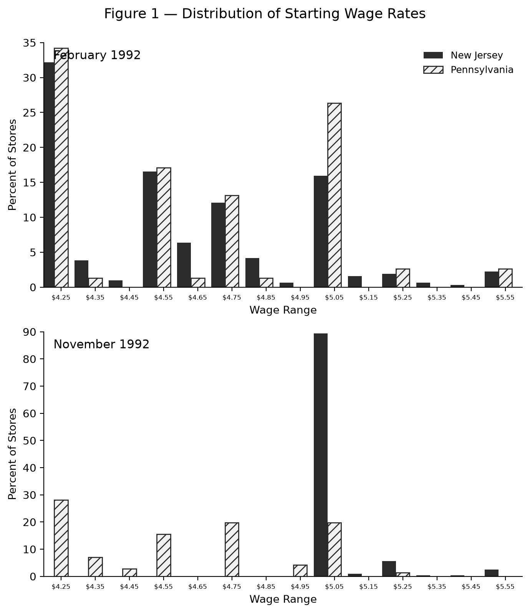

# Minimum Wages and Employment: Replication of Card & Krueger (1994)

**Author:** DAI Yibo · **Course:** ECON6067 Individual Project

---

## 1. Research question and motivation

Does raising the minimum wage reduce employment? Standard competitive-labour-market
theory predicts that a binding wage floor makes hiring more expensive and thus lowers
employment. Card & Krueger (1994) test this prediction using a natural experiment:
on **April 1, 1992, New Jersey raised its minimum wage from $4.25 to $5.05**, while
neighbouring **Pennsylvania kept it at $4.25**. Because the two states are adjacent
and economically similar, the New Jersey change provides a plausibly exogenous shock
to the cost of low-wage labour, and Pennsylvania serves as the control group.

The paper is a landmark application of the **difference-in-differences (DiD)** design
and remains a canonical reference for policy evaluation. Its headline result — that
fast-food employment in New Jersey did **not** fall (and, if anything, rose) relative
to Pennsylvania — challenged the textbook view and motivated a large follow-up
literature. This project reconstructs that result from the original survey data.

## 2. Data, sample construction, and variable definitions

**Source.** Two-wave telephone survey of fast-food restaurants in New Jersey and
eastern Pennsylvania (Burger King, KFC, Roy Rogers, Wendy's). Wave 1 was conducted
February–March 1992 (pre-treatment); Wave 2 was conducted November–December 1992
(post-treatment). The raw file `data/raw/public.csv` contains **410 restaurants × 46
columns**, one row per restaurant, with Wave-1 variables (no suffix) and Wave-2
variables (suffix `2`) side by side.

**Sample construction.**
- **Store identifier.** The questionnaire number `SHEET` is not unique (number 407
  labels two different restaurants), so the row index is used as the store id.
- **Balanced sample.** The DiD uses restaurants observed in both waves: 384 stores
  for employment (309 NJ, 75 PA) and 370 for the wage first stage (302 NJ, 68 PA).

**Key variables.**

| Variable | Definition |
|---|---|
| `STATE` | 1 = New Jersey (treatment), 0 = Pennsylvania (control) |
| `treated` | = `STATE` |
| `EMPFT` / `EMPPT` / `NMGRS` | full-time, part-time, and manager counts |
| `FTE` | full-time-equivalent employment = `EMPFT + 0.5·EMPPT + NMGRS` |
| `WAGE_ST` | starting wage |
| `CO_OWNED` | 1 = company-owned, 0 = franchise |
| `CHAIN` | brand (1=Burger King, 2=KFC, 3=Roy Rogers, 4=Wendy's) |

The `FTE` definition and the `STATE` coding were validated by matching the computed
Wave-1 means to the paper's published values (see §4) — an exact match.

## 3. Empirical design

The causal effect of the minimum wage is estimated by double differencing:

    DiD = [E(NJ, Wave 2) − E(NJ, Wave 1)] − [E(PA, Wave 2) − E(PA, Wave 1)]

Two equivalent implementations are used:
1. a comparison of mean changes across the two states (the paper's Table 3), and
2. reduced-form regressions of the store-level change on treatment and controls
   (the paper's Table 4),

        ΔY_i = α + δ · NJ_i + ε_i,

   where δ is the DiD estimate. Table 4 reports ordinary (homoskedastic) OLS
   standard errors, as in the paper; the ownership extension and the robustness
   checks use HC1-robust standard errors. The wage version is
   the *first stage* — it confirms the policy actually raised New Jersey wages —
   and the employment version is the *main result*. The identifying assumption is
   parallel trends: absent the policy, NJ and PA employment would have moved together.

## 4. Core replication results and comparison with the original

**Table 2 — Means of key variables.** Table 2 reports descriptive statistics:
the distribution of store types (Panel A) and the means of the key variables in
Wave 1 (Panel B) and Wave 2 (Panel C), separately for New Jersey and
Pennsylvania. Following the paper, the employment-composition variable is the
*percentage of full-time employees* (the store-level mean of `100 × EMPFT/FTE`),
not the raw staff counts.

| Panel | Variable | NJ | PA |
|---|---|---|---|
| A. Store types (%) | Burger King | 41.1 | 44.3 |
| | KFC | 20.5 | 15.2 |
| | Roy Rogers | 24.8 | 21.5 |
| | Wendy's | 13.6 | 19.0 |
| | Company-owned | 34.1 | 35.4 |
| B. Wave 1 means | FTE employment | 20.44 | 23.33 |
| | Percentage full-time employees | 32.8 | 35.0 |
| | Starting wage ($/hr) | 4.61 | 4.63 |
| | Wage = $4.25 (%) | 30.5 | 32.9 |
| | Price of full meal ($) | 3.35 | 3.04 |
| | Hours open (weekday) | 14.42 | 14.53 |
| | Recruiting bonus (%) | 23.6 | 29.1 |
| C. Wave 2 means | FTE employment | 21.03 | 21.17 |
| | Percentage full-time employees | 35.9 | 30.4 |
| | Starting wage ($/hr) | 5.08 | 4.62 |
| | Wage = $4.25 (%) | 0.0 | 25.3 |
| | Wage = $5.05 (%) | 85.5 | 1.3 |
| | Price of full meal ($) | 3.41 | 3.03 |
| | Hours open (weekday) | 14.42 | 14.65 |
| | Recruiting bonus (%) | 20.3 | 23.4 |

The store-type mix is essentially identical across the two states, confirming
their comparability. The two waves show the policy's bite: New Jersey's average
starting wage jumps from $4.61 to $5.08 while Pennsylvania's stays at $4.62, and
the share of New Jersey stores paying the new $5.05 minimum reaches 85.5%.

**Figure 1 — Distribution of the wage rate.** Figure 1 plots the starting-wage
distribution in a 2 × 2 grid: rows are the February 1992 and November 1992
waves, columns are New Jersey and Pennsylvania.

Before the reform both states' wages cluster at the old $4.25 minimum; after the
reform the New Jersey distribution shifts right to the new $5.05 minimum while
Pennsylvania stays at $4.25.

**Table 3 — Average employment per store before and after.** Table 3 is the
paper's headline table, and it reports **FTE employment only**. Columns (i)–(ii)
give Pennsylvania and New Jersey, column (iii) the NJ − PA difference; columns
(iv)–(vi) split New Jersey by the wave-1 starting wage ($4.25, $4.26–4.99,
≥ $5.00), and columns (vii)–(viii) give the low−high and midrange−high
contrasts.

| FTE employment | PA | NJ | NJ − PA | $4.25 | $4.26–4.99 | ≥ $5.00 | Low − High | Mid − High |
|---|---|---|---|---|---|---|---|---|
| Wave 1 (before) | 23.33 | 20.44 | −2.89 | 19.56 | 20.08 | 22.25 | −2.69 | −2.17 |
| Wave 2 (after) | 21.17 | 21.03 | −0.14 | 20.88 | 20.96 | 20.21 | 0.66 | 0.74 |
| Change (unbalanced) | −2.17 | 0.59 | 2.75 | 1.32 | 0.87 | −2.04 | 3.36 | 2.91 |
| Change (balanced sample) | −2.28 | 0.47 | **2.75** (SE 1.34) | 1.20 | 0.71 | −2.16 | 3.36 | 2.87 |
| Change (temporarily closed → 0) | −2.28 | 0.14 | 2.42 | 0.61 | 0.49 | −2.39 | 3.00 | 2.88 |

The balanced-sample difference-in-differences is **+2.75 FTE employees**
(SE 1.34, t = 2.05), reproducing the paper's +2.76 (t = 2.03). Within New Jersey
the same pattern holds: low-wage stores grew (+1.20) while high-wage stores
shrank (−2.16), for a low−high gap of +3.36 and a mid−high gap of +2.87 — the
monotone gradient the paper documents.

**Table 4 — Reduced-form models for change in employment.** Table 4 estimates the
employment effect in regressions of the store-level change in FTE employment on a
New Jersey dummy (models (i)–(ii)) or on `GAP`, the proportional wage increase a
store needed to reach the $5.05 minimum (models (iii)–(v)), with controls added
progressively. Standard errors (in parentheses) are the ordinary (homoskedastic)
OLS errors, as in the paper.

| Independent variable | (i) | (ii) | (iii) | (iv) | (v) |
|---|---|---|---|---|---|
| New Jersey dummy | +2.36 (1.15) | +2.33 (1.15) | — | — | — |
| Initial wage gap | — | — | +15.89 (5.95) | +15.19 (6.08) | +12.03 (7.32) |
| Controls for chain and ownership | no | yes | no | yes | yes |
| Controls for region | no | no | no | no | yes |
| Standard error of regression | 8.71 | 8.70 | 8.68 | 8.67 | 8.67 |
| Probability value for controls | — | 0.299 | — | 0.381 | 0.375 |

*Notes.* Standard errors are given in parentheses. The sample consists of 365
stores with available data on employment and starting wages in waves 1 and 2 (the
paper reports 357); the dependent variable in all models is the change in FTE
employment (mean −0.252 and SD 8.749 here, vs −0.237 and 8.825 in the paper). All
models include an unrestricted constant (not reported). `GAP = (5.05 −
WAGE_ST)/WAGE_ST` for New Jersey stores initially paying below $5.05, and zero
otherwise. The chain-and-ownership controls are three chain-type dummies plus a
company-owned dummy; the region controls are dummies for the three New Jersey
regions (South, Central, North) and two eastern Pennsylvania regions, one omitted
as the reference; and the last row reports the p-value of the joint F test for
exclusion of all control variables.

The positive `GAP` coefficient has the expected gradient interpretation: stores
facing the largest mandated wage increase saw the largest employment gains, and
the estimate is robust to controls. Adding region controls (column (v)) attenuates
the coefficient and raises its standard error, mirroring the paper. The estimates
track the paper's (2.33, 2.30, 15.65, 14.92, 11.91); the small residual
differences reflect the public dataset's sample (n = 365 vs the paper's 357).

**Table 5 — Change in wages (first stage).**

| | Pennsylvania | New Jersey | Difference (NJ − PA) |
|---|---|---|---|
| Wave 1 (before) | 4.63 | 4.61 | −0.02 |
| Wave 2 (after) | 4.62 | 5.08 | +0.46 |
| Change | −0.01 | +0.47 | **+0.48** (SE 0.05) |

The starting wage rose by $0.47 in New Jersey and was flat in Pennsylvania, for a
wage difference-in-differences of **+0.48 (SE 0.05)** — the first stage confirming
the policy actually raised New Jersey wages.

**Comparison with the original paper.** The paper reports a wage DiD of **+0.48**
and an FTE-employment DiD of **+2.76 (SE 1.36)**. Our estimates — **+0.48** and
**+2.75 (SE 1.34)** — reproduce them essentially exactly, and the wave-1/wave-2
means match the published values to two decimals. The reduced-form `GAP` estimates
(+15.89 vs the paper's +15.65) and the New Jersey dummy (+2.36 vs +2.33) also
track the original. The substantive conclusion is unchanged: New Jersey's
minimum-wage increase did **not** reduce employment. Relative to Pennsylvania,
FTE employment rose by about 2.75 workers per store, with the share of full-time
staff rising in New Jersey relative to Pennsylvania (32.8 → 35.9% vs 35.0 →
30.4%).

## 5. Independent extension: does the effect differ by store ownership?

**Question.** Is the (null/positive) employment response uniform, or does it differ
between **franchise** and **company-owned** outlets, which face different cost
structures, compliance, and local market power?

**Design.** On the balanced sample, estimate

    ΔFTE_i = α + δ·NJ_i + β·CO_OWNED_i + γ·(NJ_i × CO_OWNED_i) + ε_i,

so δ is the DiD for franchises, δ + γ for company-owned stores, and γ the difference.

**Results.**

| Group | NJ change | PA change | DiD |
|---|---|---|---|
| Franchise (`CO_OWNED=0`) | +0.72 | −2.41 | **+3.13** (SE 1.89) |
| Company-owned (`CO_OWNED=1`) | −0.01 | −2.05 | **+2.04** (SE 1.53) |
| Difference (interaction) | | | **−1.10** (SE 2.43, p = 0.65) |

**Interpretation.** The positive employment effect appears in *both* ownership types,
and the interaction is far from statistically significant. There is therefore no
evidence that the minimum-wage effect is driven by, or concentrated in, a single
ownership type — the headline result is robust across ownership structures. The
limited precision (small Pennsylvania cells of 49 and 26) is noted as a caveat.

## 6. Validation, limitations, and conclusion

**Validation.**
- The `FTE` formula and state coding reproduce the paper's Wave-1 means exactly
  (NJ 20.44 / PA 23.33 for employment; NJ 4.61 / PA 4.63 for wages).
- `DATE2` (MMDDYY) spans 11-05-1992 to 12-31-1992, matching the documented Wave-2
  field period.
- The duplicate `SHEET` number and the NJ-region-dummy collinearity were identified
  and handled (see the AI-use disclosure).

**Robustness.** The employment DiD is stable across specifications. On the full
balanced sample the baseline is +2.75 (Table 3); restricting to stores with
complete controls (n = 361), it is +3.02 with no controls, +2.98 adding chain
fixed effects, and +2.70 adding chain FE, ownership, hours, and prices. All are
positive, and the first three are statistically significant at conventional
levels.

**Limitations.** (i) The Pennsylvania control group is small (75 stores in the
balanced sample), limiting
precision; (ii) with only two waves, the parallel-trends assumption cannot be
formally tested; (iii) the outcome is a snapshot measure of employment in a single
low-wage industry, so external validity is limited.

**Conclusion.** The replication recovers the paper's famous finding almost exactly:
New Jersey's 1992 minimum-wage increase did not reduce fast-food employment and,
relative to Pennsylvania, employment rose by roughly 2.75 FTE workers per store. An
original extension finds no significant heterogeneity by ownership type, reinforcing
the robustness of the result.

## Reproducibility

With Python 3.14 and the packages in `requirements.txt` (pandas, numpy, statsmodels,
matplotlib, markdown), run from the project root:

    python3 -m venv .venv && .venv/bin/pip install -r requirements.txt
    .venv/bin/python -I code/run_all.py

This regenerates all tables in `outputs/tables/` and figures in `outputs/figures/`.
